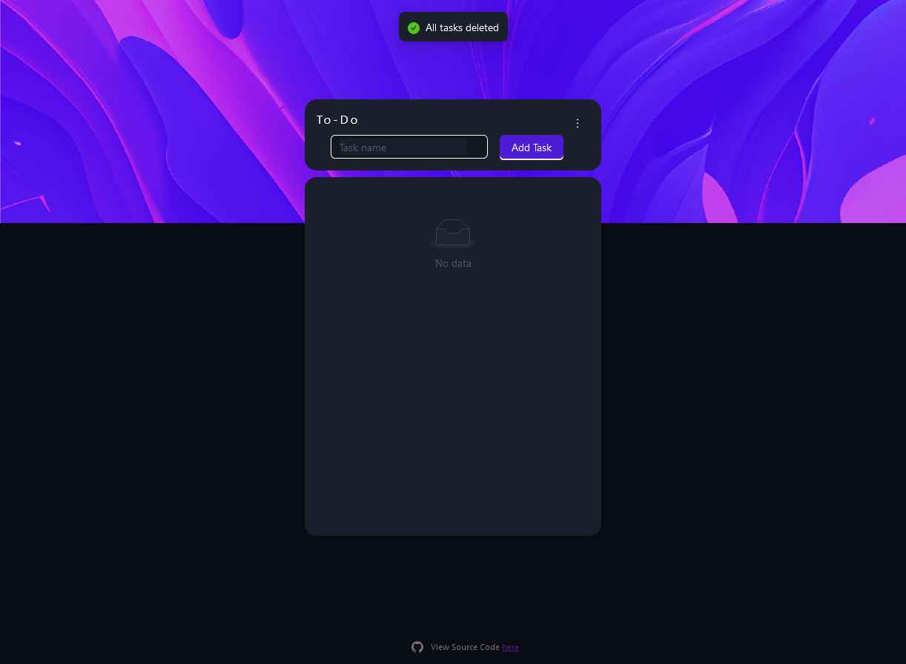
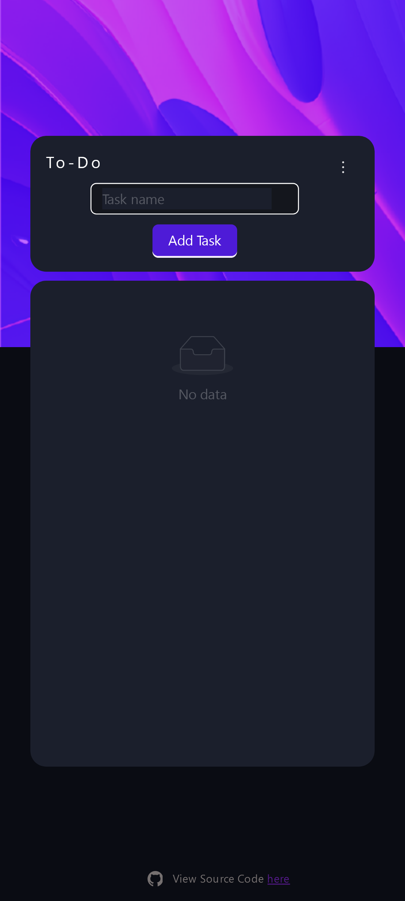

# loginPage 
**Project Description**   
This is todo app project to manage tasks built with [React](https://reactjs.org/) and [Ant Design](https://ant.design) UI library
  
>  Preview it [here](https://Annaick.github.io/toDo)
  
## Table of contents 
- [Overview](#overview)
    - [Screenshot](#screenshot)
    - [Preview](#preview)
    - [Built with](#built-with)
- [Author](#author)
- [Aknwolegments](#acknowledgments)
----  
## Overview  
The application intervace is simple to make it easy to use, users can add, modify and delete tasks and above all mark them when they're commpleted
### Screenshot

*Desktop*  

*Mobile* 

### Preview
- Live Site: Click [here](https://Annaick.github.io/toDo)  

###  Built with
- [Vite](https://vitejs.dev) as Build tool
- [npm](https://npmjs.com) as package manager
- Framework [React](https://reacjs.org)
- [Ant Design](https://ant.design) UI library
----
## Author
- LinkendIn: Click [here](https://www.linkedin.com/in/tiana-anna%C3%AFck-b21914285?utm_source=share&utm_campaign=share_via&utm_content=profile&utm_medium=android_app
)
- Email: annaick.tiana@gmail.com

## Acknowledgments
- Background image: [source](https://www.vecteezy.com/photo/21171659-colorful-abstract-wallpaper-modern-background-ai-generated)
- App model: [source](https://dev.to/hariramjp777/todo-app-using-html-css-and-js-local-storage-design-html-and-css-1m0j)